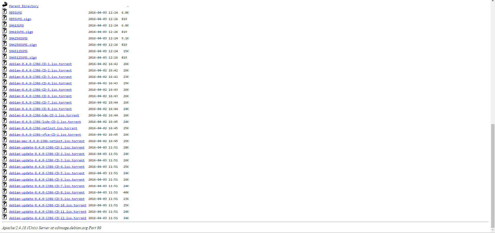
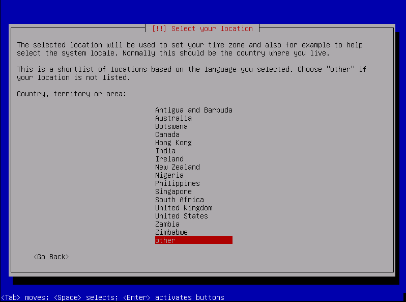
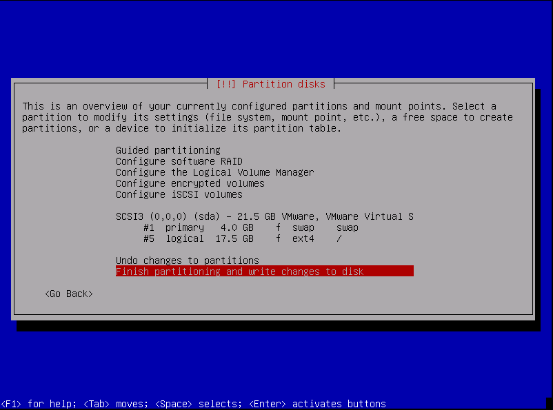
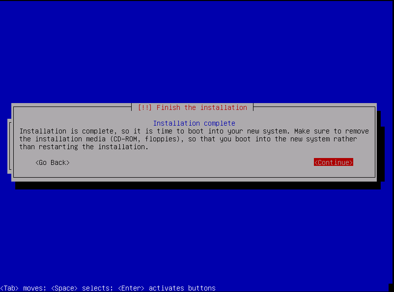

# debian 安裝教學

我們用的是 debian，所以先到官網下載安裝檔吧

## 下載

debian 的下載網址 [https://www.debian.org/CD/index.en.html](https://www.debian.org/CD/index.en.html)

在下載畫面裡可以挑選妳是要用 bt下載 或是 網路下載

因為我怕網路不穩所以我選擇了bt下載

(在圖片中也有提示 "__大多數的人可能都使用 "i386" 的映像檔，即 Intel 系統架構。__")

下載的版本都是目前官方穩定的版本

__請確定您取得的映像檔是適用於您的電腦！__

## 安裝

### 安裝語言

### 位置選擇
位置選擇台灣 (其他>亞洲>台灣)

### 鍵盤選擇美式鍵盤

這時會跑一下子

### 設定

設定一個自己喜歡的主機名稱。請注意debian的主機名稱不是完整的FQDN，也就是不包含domain name；如果你習慣像是OpenSuSE或是Fedora的主機名稱(FQDN)的話，那麼此處的主機名稱相當於一個alias。假設你家裏是需要撥接才能上網，你會卡在網路設定錯誤的地方。選擇不要現在設定網路，我們在本文最後會安裝撥接上網的程式。

因為我們不做任何服務，也沒有申請 domain name，所以直接 Enter 跳過。

設定Root密碼

再次輸入密碼

這時會叫你申請一個普通使用者帳號

其中user name是指真實的姓名，account是指系統的帳號

### 分割區

再來是設計分割區

選擇最下面自己分割吧

一開始要先格式化

選擇沒用過的空間

先建立第一個分割區為swap。在一顆硬碟的最前端當作swap已經是一個經驗法則，既然系統運行會忙碌到用到swap，那麼就把置換空間放在最前面讓swaping的效率達到最好，當然，能不用到swap是最好。一般而言，swap會是ram的兩倍大小。
假設系統已經有到4G以上的記憶體空間，需要分割swap嗎？有需要讓swap是兩倍記憶體大小的空間嗎？事實上swap的存在未必一定是swaping時使用，當系統待命或休眠時，就會用到swap。另外swap的大小跟系統配置記憶體快取的大小有關，也就是系統會根據swap大小依據不同的演算規則管理記憶體；根據Netman老師的說法，兩倍記憶體大小的swap是最恰當的--犧牲一點硬碟空間，而得到效率最好地演算法。

將剛剛切好的分割區改成 swap

完成 !

再來就是一個新的分割區來放 /

選擇 Mount options

建議至少把noatime勾起來！

完成 !

確定好了之後就要跑一陣子了，但別去做其他事

安裝的途中還有一些問題要選擇

出現了  這個地方看你要不要，但大家應該都選 no

這個地方請先選no。因為你選擇了 yes，就會變成所有的套件都由網路安裝，那麼你先前耗費時間跟網路頻寬下載那片iso就失去意義了。

是否加入debian套件使用統計。選擇YES會讓使用者所安裝的套件會回報給debian，我一般都會選YES。

如果只有一個作業系統，就必需安裝開機管理程式到MBR。假設有多個系統，才有可能安裝在自己/下的boot sector。

恭喜安裝完了

完成 !

